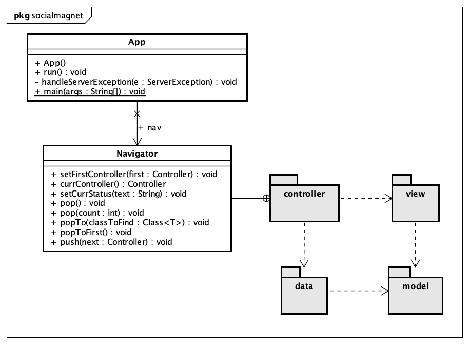
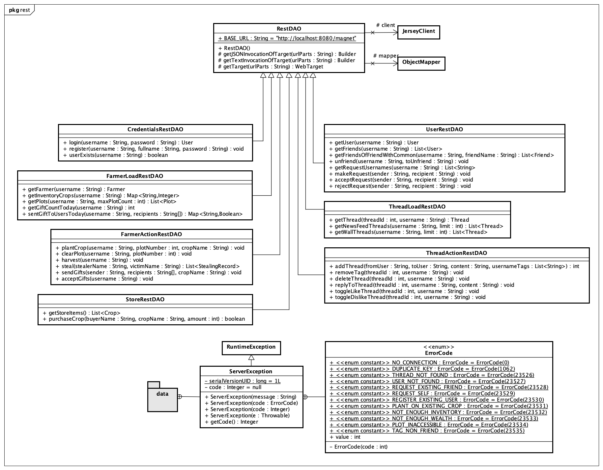
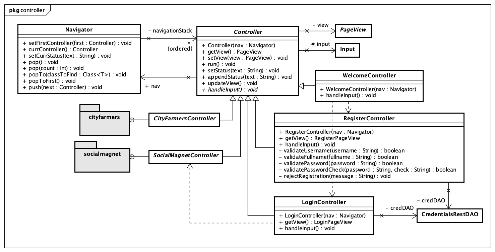
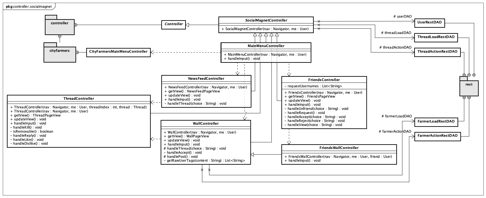
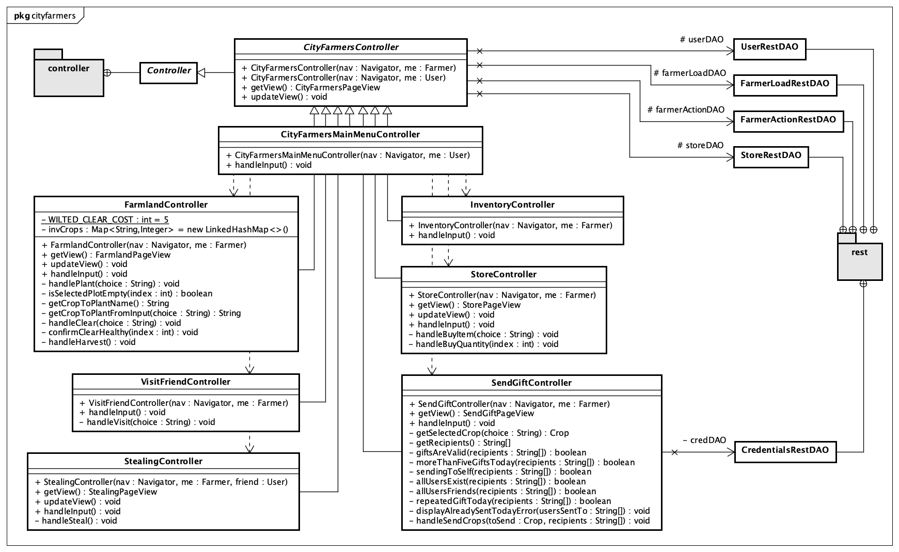
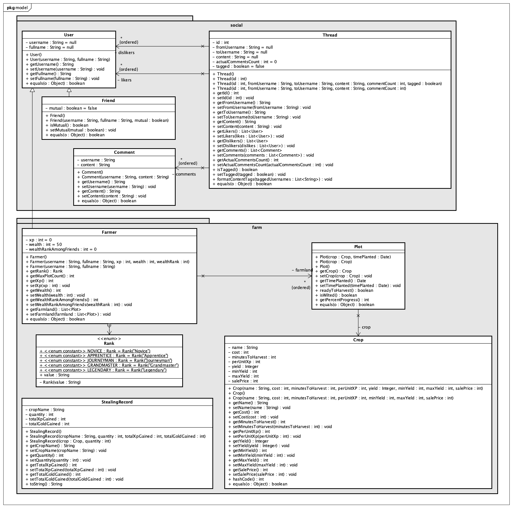
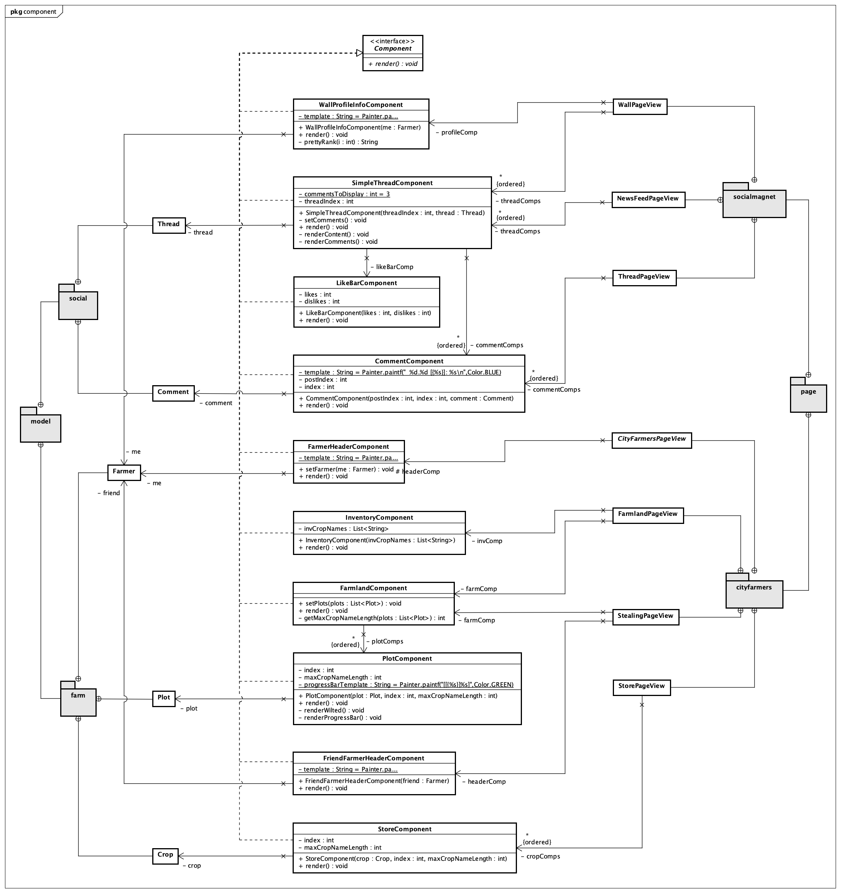
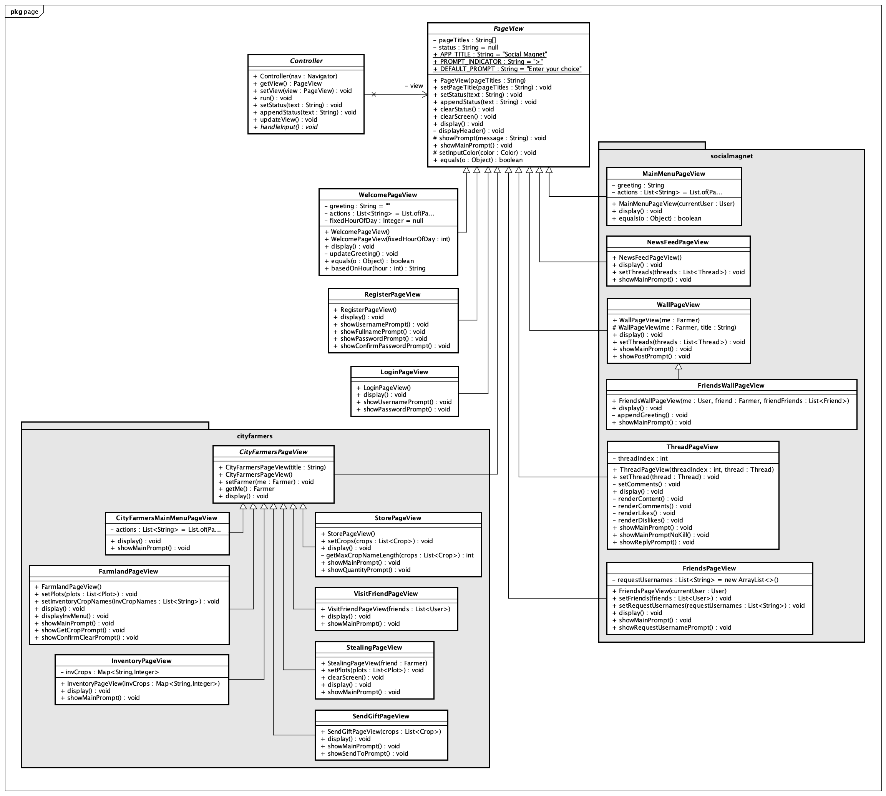
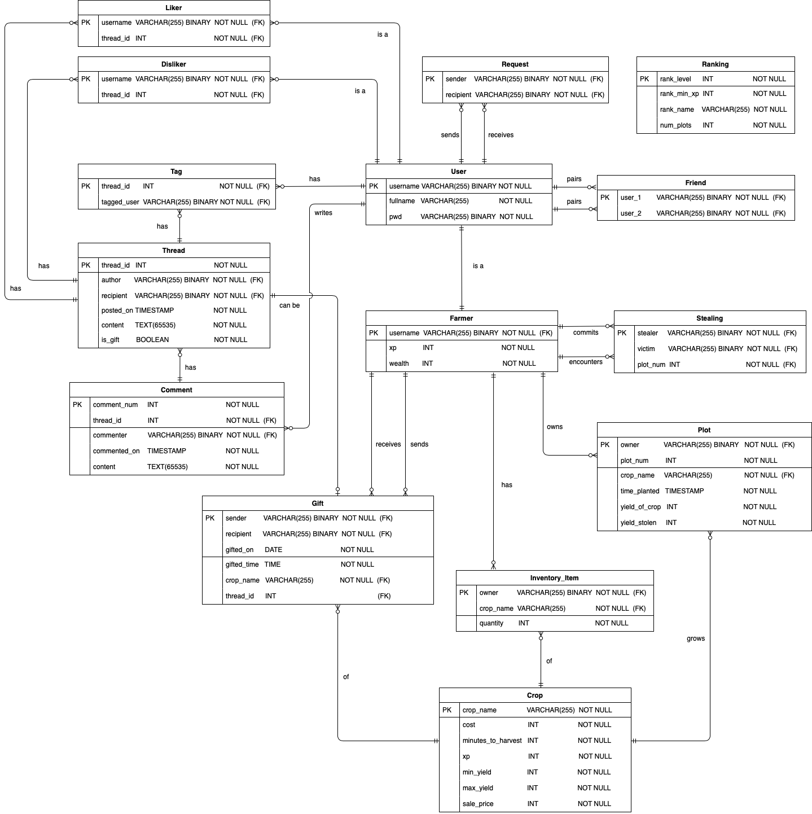
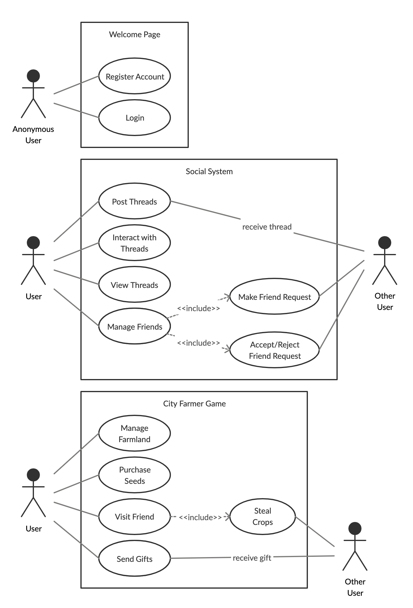

# Application Analysis and Design

## Design Considerations

In designing our application, we adopted some key principles:

1. The database is the single source of truth for all data.
2. The design of the database should be decoupled from the application.
3. The navigation state of the application should be handled in one single location.
4. The UI of the application should be as modular as possible in accordance to object-oriented principles.

In addition to these key principles, a few miscellaneous design decisions are listed in the appendix.

### Database-First Approach

When considering how state was to be stored for the application, we chose to use a [single source of truth](https://en.wikipedia.org/wiki/Single_source_of_truth) approach. Due to the relatively simple data storage requirements, this practice afforded some benefits:

* There is no issue with application state and database state being out-of-sync.
* Rendering updated data becomes much simpler as we can rely on the database to keep track of changes.
* We can validate all transactions on the database, allowing easier enforcement of database rules.
  * Application crashes between database queries would not result in invalid database state.
    * For example, it is much more difficult to purchase seeds and receive them without having your account balance be deducted.

However, we do note that this approach does come with some limitations.

* It is much harder to scale up the application should we need to do so.
  * For a small project, we accepted this cost for the benefits of simpler state management.
* If the database is slow to respond (e.g. served over a web service), then our application becomes unnecessarily sluggish.
  * Our approach to solving this issue will be to create a data cache on the application between the DAO layer and the database layer. This cache will abstract all DAO calls and serve cached data whenever possible and queue any updates to data for the database.

### Application Architecture

Due to the complexity of this project, we decided to break our application into four distinct components.

**Views** accept data and handles presentation to the UI (console output).

**Models** represent units of information queried from the database, and act as data containers to be injected into views.

**Database Access Objects (DAOs)** handle application-database communication, and formats raw database information into model representations.

**Controllers** handle application state, access DAOs for models, inject those into views, and handle user input to decide the next state.

#### Views

We decided to differentiate between two types of views:

1. `PageView` is responsible for representing an entire page managed by a `Controller` which it has a one-to-one relationship with.
2. `Component` is responsible for displaying a single `Model`, and therefore should be tied to its associated `Model`.

> `PageView` is `Controller` centric, while `Component` is `Model` or data centric.

`PageViews` can render models directly. However, when a model needs to be rendered repeatedly in a complicated format (e.g. threads on the News Feed), a `Component` should be used within the `PageView`.

```java
public class NewsFeedPageView extends PageView {
    // Components representing the threads on the News Feed
    List<SimpleThreadComponent> threadComps;

    @Override
    public void display() {
        super.display();
        for (SimpleThreadComponent threadComp : threadComps) {
            threadComp.render();
        }
    }
}
```

This allows our UI code to be much more modular:

* We can reuse multiple `Components` across different `PageViews` (e.g. `SimpleThreadComponent` is used in both `NewsFeedPageView` and `WallPageView`)

```java
public class NewsFeedPageView extends PageView {
    private List<SimpleThreadComponent> threadComps;
      
public class WallPageView extends PageView {
    private WallProfileInfoComponent profileComp;
    private List<SimpleThreadComponent> threadComps;
```

* We can extend `PageViews` to create more specialised `PageViews` (e.g. All City Farmer related `PageViews` extend a specialised  `CityFarmersPageView`, which extends `PageView`)

```java
public abstract class CityFarmersPageView extends PageView { ...
```

##### Static vs Dynamic Data Representation

**Static data** refers to data that is not expected to change during the lifecycle of a `Controller` (e.g. the username of the logged-in user on the Main Menu).

**Dynamic data** refers to data that can be updated before a `Controller` is popped off the navigation stack (e.g. the wealth of a user can change after harvesting crops on My Farmland).

When developing the application, we settled on the following practices:

* Static data should be passed into `Views` only once through its constructor.

* Dynamic data should be passed into `Views` before every display update through setter methods on the `View`.

```java
public class WallPageView {
    // Not expected to update while WallPageController is on the navigation stack.
    public WallPageView(String currentUsername) {}

    // Will be updated when navigating back from ThreadController.
    public void setThreads(List<Thread> threads) {}
```

#### Models

When designing our models, we initially represented all relationships.

```java
public class User {
    List<User> friends = ...
    List<Thread> newsFeedThreads = ...
```

However, this presented some issues.

* Given a unary relationship (i.e. the current user and his friends are all Users), we cannot maintain model integrity.
  * Assume the `User` model has a field of other `Users` to represent friends.
  * Given `user1` and `user2` are friends, we cannot fully load the attributes of `user2`, as it would recursively load `user1` again.
  * If we choose to only load shallow details of `user2`, this **violates the integrity of our models**, as we have two instances of `User` that have different specifications, `user1` containing a proper list of his friends, and `user2` only containing shallow information.
* Many-to-many relationships result in duplicate data loading.
  * Given a list of friends, some threads can appear multiple times under different friends due to tagging. Without special handling, this results in much wasted data storage and usage.
* Some one-to-many relationships are unnecessary.
  * Given a list of friends, we will not likely access everyone's walls. Therefore, a lot of data loaded goes unused and database bandwidth is wasted.

##### Slim Models

Refering to our database-first approach, we decided to treat our models as **units of information that represent a single entity**, and load relationships from the database only when required.

For example, the `User` model should only contain a username and his fullname, as those are the only two pieces of information that are directly associated with a user.

We will only lazily load any extra information from the database when we need to do so, and store that data on the controller instead.

* We only load the News Feed Threads of a user when we navigate to the News Feed page.

```java
public class WallController extends Controller {
  	// The farmer and the threads on his wall are stored separately
    Farmer farmerToDisplay;
    List<Thread> wallThreads;
```

##### Relational Attributes

While we do not represent relationships on our models, we treat one-to-many relations between different tables as **multivariate attributes**. Therefore, some models will still contain multi-valued references.

* For example, `Farmers` have a one-to-many relationship with their `Plots`. As the state of the farmer himself relies on his plots, we chose to model that relationship under our `Farmer` model, which extends our `User` model.

```java
public class Farmer extends User {
    List<Plot> farmland;
```

#### Database Access Objects

Database Access Objects (DAOs) abstract the backend systems of our application stack. Our DAOs use a REST client to communicate with our web service, with source code located under `server/`.

* Upon a failed or lost connection, we throw a custom `ServerException` runtime exception which is bubbled up to the `App` event loop.
* `App` will gracefully handle the connection failure, and log the user out.

#### Decoupling the Database and Application

##### Using stored procedures before transitioning to web service

During initial development, the application connected to the database directly. Therefore, we had to make queries to the database.

At first, SQL queries were hardcoded in the application itself.

```java
String queryString = String.join(" ",
    "SELECT username, fullname",
    "FROM",
    "(SELECT user_1 AS friend_name FROM friend WHERE user_2 = ?",
    "UNION",
    "SELECT user_2 FROM friend WHERE user_1 = ?) AS f",
	  "JOIN user ON friend_name = user.username;"
);
```

However, this presented multiple issues:

* Compile-time errors were not caught.
* Updates to the database design required recompilation of the application.
* Actions that required multiple updates to multiple tables were difficult to implement without increasing the number of queries to the database.

Instead, we abstracted all database-related logic on the database itself through stored procedures.

`UserDAO.java`

```java
String queryString = "CALL get_friends(?)";
```

`deploy.sql`

```mysql
CREATE PROCEDURE get_friends(IN _username VARCHAR(255))
    SELECT username, fullname FROM (
        SELECT user_1 AS friend_name FROM friend WHERE user_2 = _username
        UNION
        SELECT user_2 FROM friend WHERE user_1 = _username
    ) AS f
    JOIN user ON friend_name = user.username;
```

This afforded us some benefits:

* Compile-time errors were caught by the MySQL engine when deploying the database
* We could remodel our database behind stored procedures without having to update our application.
* Complicated transactions could be performed on the database itself, and the application can rely on the state of the database to be valid.

Essentially, the database handles all data logic, and the client application serves a user-friendly view of the database state.

##### Using a REST API

Currently, all database logic has been further abstracted away behind a REST API, with source code stored under `server/`. However, the usage of stored procedures made the transition to a server-side implementation of a database much easier.

As the database was already handling most of the business logic, there was little restructuring of the application to be done. We simply moved all database access objects to the server, and created new API access objects, packaged under `com.g1t11.socialmagnet.data.rest`. Once feature parity was reached between the previous DAO implementations and the API access objects, usage of access objects could simply be substituted.

### Controllers

Console applications go through a predictable event cycle:

```
update console... wait for input... perform actions... update console...
```

Therefore, we decided early on that our controllers will all implement the same behaviour.

```java
public abstract class Controller {
    public void run() {
        updateView();
        handleInput();
    }
    ...
}
```

### State Pattern with Navigation

In addition to the four components, we designed a **Navigation object**.

The **Navigation** object is used to implement the [state pattern](https://en.wikipedia.org/wiki/State_pattern), where the behaviour of our application depends on its current state/controller.

The first controller on the base of the navigation stack represents our application's starting state, and the last controller on the top of the stack always represent the current state of our application.

#### Benefits

As such, we can control the execution of our application with just one event loop, and depend on the state of our navigation stack to control behaviour.

```java
public class App {
    public void run() {
        while (true) {
            nav.currentController().run();
        }
    }
}
```

This behaviour allows us to inspect `Navigation` whenever we need to check the state of our application, instead of having to trace a navigation path from `Controller` to `Controller`.

#### Limitations

However, this approach does create some issues.

##### Two-way binding of Navigation and Controller

All `Controllers` are initialised with a `Navigation` object, and `Navigation` pushes and pops `Controller` objects onto its stack.

```java
public class Controller {
    public Controller(Navigation nav) {
        this.nav = nav;
    }
}

public class Navigation {
    public void push(Controller next) {
        navigationStack.add(next);
    }
}
```

This creates a cyclic dependency between `Controllers` and `Navigation`, which is necessary for `Navigation` to maintain its stack of `Controllers`, and `Controllers` to decide the next `Controller` to push onto `Navigation`.

However, `Controller` tests are a little bit more difficult to set up, as we also have to initialise a `Navigation` object whenever we use a `Controller`.

For example, to navigate to other controllers, we first have to instantiate the `Controller` with the `Navigation` object, then push it onto the stack.

```java
// current controller: WelcomeController
nav.push(new RegisterController(nav));
// current controller: RegisterController
nav.pop();
// current controller: WelcomeController
```

#### Passing data between Controllers

If data needs to be passed between controllers, it must be done so through their constructors.

This is to ensure that only static data is passed in between controllers on the application.

In accordance with the database-first approach, any data that is expected to update during a controller's lifecycle should do so on the database first. Then, any other controllers that rely on updated data should query the database first before presenting its view.

## Diagrams

### Class Diagrams

##### Overview



##### Data Access (REST API)



##### Controllers







##### Models



##### Views (Components)



##### Views (Page Views)



### Logical Diagram



### Use Case Diagram



## Appendix

#### Database Credentials

We load our database credentials through system environment variables stored outside the git repositry to minimise exposure of sensitive data.

#### Saving tagged user information

We wanted to remember which tags were valid at the time of post creation. In addition, we need to remember where our tag was created within the content so that we could highlight the tag appropriately.

Given our requirements, we had two options of persisting that information:
1. Store a relationship table that associates users tagged to posts, and store the index of the tag within the post.
2. Mark valid user tags within the content using special format markers.

While option 2 seemed simpler, it came with multiple disadvantages
* Content on the database was littered with format markers, and the client application had to format it accordingly every time.
* There was no relational representation of the tagging relationship
* We would have to handle edge cases where content might contain our format markers

Instead, we adopted option 1, and represent the tagging relations with a table, while storing the original `@` tagging markers in the database.

When we load content onto the database, we run through the string for all occurences of `@`, and validate the tag against the relational data before formatting accordingly.

* We assume that a user can only be tagged once in a post, and only the first valid tag is formatted.

#### Displaying gift threads

We considered two approaches to handling threads for gifts.

1. Only store the gifting information, and create an artificial view of the gifts to be unioned with regular thread information.
2. Insert a new thread for every gift, delete the thread when the gift is accepted, or reject the gift when the thread is killed.

Both approaches presented some issues.

##### Gift threads as artificial views

Presenting gift threads as views of the original gift data does minimise storage space. However, this presents multiple issues:

* All thread actions (liking, disliking, replying, killing) depend on the thread ID being unique and consistent. However, if gift threads are presented as views of the original gift data, the identification of gifts is much more difficult, and actions are much harder to track as well.
* The querying of thread information is much more difficult, as we have to combine two functionalities -- selecting of threads to display for the news feed and/or wall, and formatting of gifts to be presented as gift threads -- into one.

##### Gift threads as actual threads

It is much more simple to store the gift thread data on the database. While there are some disadvantages, our team decided that this was the better option:

* There is duplication of gifting data, which can result in delete anomalities i.e. a gift thread being deleted without the corresponding gift being accepted or rejected.
  * However, as our data is accessed and modified through stored procedures only, we have much stronger access control, and can better enforce rules on gift creation and deletion.
* The lookup for a gift's corresponding thread is slow, as the DBMS will have to search based on four moderately complicated keys -- `thread.author = gift.sender`, `thread.recipient = gift.recipient`, `DATE(thread.posted_on) = gift.gifted_on`, and `thread.is_gift = TRUE`.
  * We can resolve the expensive query by attaching the thread ID to each gift, and making our query based on that.
  * When a gift is accepted, we delete the corresponding thread.
  * When the thread is deleted, we will set the ID to null to indicate that the gift has been either accepted or rejected.

As such, we decided to adopt the approach of storing gift threads in the `thread` table.
